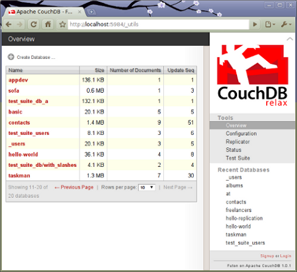

A fejlesztői és futtató környezet létrehozása
=============================================

## A CouchDB installálása

A munkához mindenek előtt szükségünk van egy működő CouchDB serverre

Ehhez a legegyszerűbben úgy juthatunk hozzá, hogy létrehozunk egy saját,
ingyenesen használható példányt a [Couch_One_Hosting][] oldalán.

Ha saját, lokális példányt kívánunk futtatni, akkor a legegyszerűbb, ha az előre
legyártott, bináris verziót töltjük le, és rakjuk fel a saját gépünkre.
A megfelelő platformhoz legyártott, azonnal installálható verziók a
[Couch_One_Products][] oldalán keresztül érhetők el.

Ha forrásból kívánjuk reprodukálni a teljes rendszert,
akkor ehhez a megfelelő verzió forráskódját a
[project download oldaláról](http://couchdb.apache.org/downloads.html)
tudjuk megszerezni.
Ehhez azonban az Erlang fordítóra, és számos egyéb kiegészítő könyvtárra is
szükség van. Melyek platformról-platformra eltérő előkészítést igényelnek.
Ráadásul egy adott platform különböző verziói között is vannak eltérések,
a fordító környezet kialakítását illetően.
Ezért mindenképpen a bináris, előre lefordított változattal célszerű először
próbálkozni.

Például Ubuntu 10.04-en, a CouchOne oldaláról letöltött
[CouchOne for Ubuntu, all inclusive and ready to go binaries](http://www.couch.io/get#ubuntu)
verzió minden gond nélkül feltelepíthető.
Ehhez mindössze el kell indítanunk az előzőleg letöltött
__install-couchdb-1.0.1_rel1-linux.bin__ nevű file-t.

Az installálás során létre kell jönnie egy __couchdb__ nevű user-nek.

Ezt követően a server az alábbi paranccsal indítható el:

    sudo -i -u couchdb couchdb

Erre a server valami hasonlót ír ki a konzolra
(a konfigurációs lista a rövidített példánál lényegesen hosszabb lehet):

    Apache CouchDB 1.0.1 (LogLevel=debug) is starting.
        Configuration Settings ["/usr/local/etc/couchdb/default.ini",
                                "/usr/local/etc/couchdb/local.ini"]:
        [couchdb] database_dir="/usr/local/var/lib/couchdb"
        [couchdb] max_attachment_chunk_size="4294967296"
        [couchdb] max_dbs_open="100"
        [couchdb] max_document_size="4294967296"
        ...

    Apache CouchDB has started. Time to relax.
        [info] [<0.33.0>] Apache CouchDB has started on http://127.0.0.1:5984/

Ezután már megszólíthatjuk az adatbáziskezelőt, hogy ellenőrizzük,
minden rendeltetésszerűen működik-e. Ezt megtehetjük egy böngészővel,
vagy a __curl__ segédprogrammal, a következő paranccsal:

    curl -X GET http://localhost:5984/

Az URL-ből látható, hogy a CouchDB alapértelmezésben a __5984__-es porton figyel.
válaszképpen az alábbi JSON dokumentumot kell kapnunk:

    {"couchdb":"Welcome","version":"1.0.1"}

A CouchDB adminisztrációs felületét, melyet _Futon_-nak hívnak a következő URL-en
keresztül érhetjük el egy böngészővel:

    http://localhost:5984/_utils

A böngészőben az ábrán láthatóhoz hasonlót kell látnunk:

Miután rendelkezünk egy megfelelően működő CouchDB adatbáziskezelő serverrel,
hozzáfoghatunk az adatbázis feltöltéséhez.
Ez a közönséges adatokon kívül a kliens oldalon megjelenítendő web-es tartalmak
(HTML, CSS, stb.), továbbá a server oldali alkalmazások feltöltését is jelenti.

Ez azért lehetséges, mert a CouchDB számára a web-es alkalmazások éppen olyan
dokumentumok, mint bármi más, közönséges tartalom.

A programokat egy speciális (__\_design/__) mintázattal kezdődő nevű
dokumentumban tárolja az adatbáziskezelő, JSON formátumban.

A \_design dokumentumokat létrehozhatjuk a  _Futon_-nal,
és a kódot begépelhetjük az adminisztrációs felületen keresztül, melyet
a web-es felület biztosít számunkra.
Ez azonban nagyobb programok esetében nem a legoptimálisabb,
és legkényelmesebb megoldás.

A programok általában többféle formátumban, számos forráskód file létrehozásával
készülnek. Ezek szerkesztéséhez speciális fejlesztői környezetek támogatását
tudjuk igénybe venni _syntax highlite_-tal, beépített verzió követő támogatással,
és számos egyéb funkcióval.

A CouchDB-hez készült egy segédeszköz, ami lehetővé teszi, hogy a megszokott
eszközeinkkel készítsük el a forrás file-jainkat (HTML, CSS, JavaScript, stb.)
Majd ezeket feltöltsük a serverre.

Erre a célra használható a [CouchApp][] nevű segédeszköz,
amire a továbbiak során a fejlesztéshez szükségünk lesz.

A [CouchApp][] egyebek közt segít minket abban,
hogy a HTML5/JavaScript technológiával írt alkalmazásainkat
a CouchDB által elvárt strutúrában,
és JSON-ná konvertálva egyetlen parancs végrehajtásával tölthessük fel.
Ezen felül JavaScript könyvtárakat biztosít a kliens oldalon az általunk írandó
programok számára, hogy azok egyszerűbben elérhessék a servert,
a server oldalon pedig ahhoz, hogy kiszolgáljuk a beérkező kéréseket,
lekérdezéseket hajthassunk végre.

A soron következő lépés tehát a [CouchApp][] installálása.

## A CouchApp installálása

A CouchApp alkalmazást legegyszerűbben a Python __easy_install__
scriptjével installálhatjuk, amely a __setuptools__ csomag része.
Amennyiben ez nincs rajta a gépünkön,
akkor előzetesen gondoskodni kell annak meglétéről.

Például Ubuntu-n az alábbi paranccsal installálhatjuk:

     sudo apt-get install python-setuptools

Miután az easy_install-t sikeresen telepítettük,
hajtsuk végre a következő parancsot:

     sudo easy_install -U couchapp

Próbaképpen hajtsuk végre a következő parancsot:

    couchapp version

A válasznak a következőhöz hasonlónak kell lennie:

    Couchapp (version 0.7.0)
    Copyright 2008-2010 Benoît Chesneau <benoitc@e-engura.org>
    Licensed under the Apache License, Version 2.0.

Ha sikertelen volt az installáció, annak egyik gyakori oka lehet,
hogy nem megfelelő verziójú komponensek vannak a gépünkön.
Ilyenkor megpróbálkozhatunk a következő
parancsokkal upgrade-elni mind a setuptools,
mind pedig a couchapp alkalmazást:

     sudo easy_install -U setuptools
     sudo easy_install -U couchapp

Ha ez is sikertelen volt, akkor a Python setuptools oldalon,
illetve a CoucApp levelező listán próbálhatunk további segítséghez jutni.
